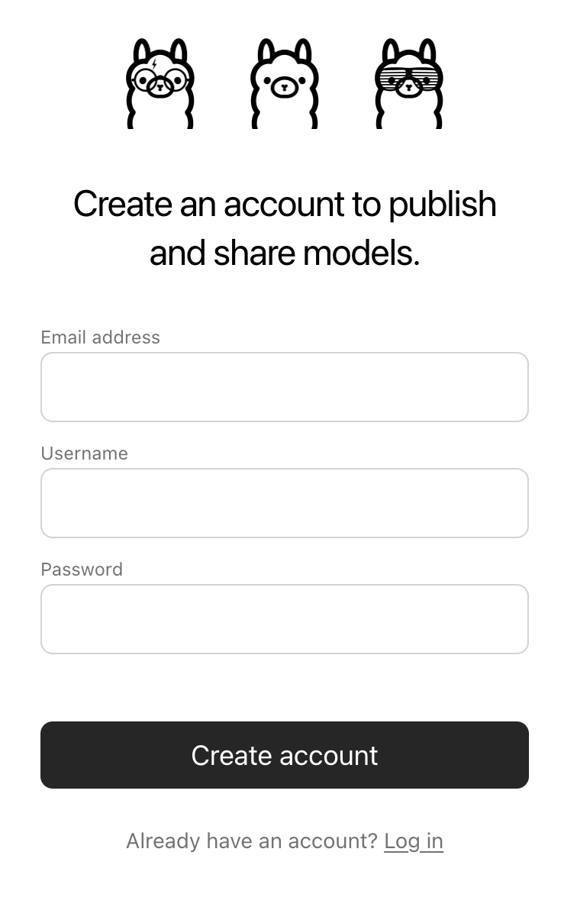

# 모델 가져오기

## 목차

  * [Safetensors 어댑터 가져오기](#Safetensors-가중치에서-파인튜닝된-어댑터-가져오기)
  * [Safetensors 모델 가져오기](#Safetensors-가중치에서-모델-가져오기)
  * [GGUF 파일 가져오기](#GGUF-기반-모델-또는-어댑터-가져오기)
  * [ollama.com에서 모델 공유하기](#ollamacom에서-모델-공유하기)

## Safetensors 가중치에서 파인튜닝된 어댑터 가져오기

먼저, `FROM` 명령어로 파인튜닝에 사용한 기본 모델을 지정하고, `ADAPTER` 명령어로 Safetensors 어댑터가 있는 디렉토리를 가리키는 `모델파일`을 생성합니다:

```dockerfile
FROM <기본 모델 이름>
ADAPTER /path/to/safetensors/adapter/directory
```

`FROM` 명령어에서 어댑터를 생성할 때 사용한 기본 모델과 동일한 모델을 사용해야 합니다. 그렇지 않으면 예기치 않은 결과가 발생할 수 있습니다. 대부분의 프레임워크는 서로 다른 양자화 방법을 사용하므로, 비양자화된(즉, 비-QLoRA) 어댑터를 사용하는 것이 최선입니다. 어댑터가 `모델파일`과 동일한 디렉토리에 있다면, 어댑터 경로를 지정하기 위해 `ADAPTER .`를 사용하세요.

이제 `모델파일`이 생성된 디렉토리에서 `ollama create` 명령어를 실행합니다:

```bash
ollama create my-model
```

마지막으로 모델을 테스트합니다:

```bash
ollama run my-model
```

Ollama는 다음과 같은 여러 모델 아키텍처 기반의 어댑터 가져오기를 지원합니다:

  * 라마 (라마 2, 라마 3, 라마 3.1, 라마 3.2 포함);
  * 미스트랄 (미스트랄 1, 미스트랄 2, 믹스트랄 포함);
  * 제마 (제마 1, 제마 2 포함)

Safetensors 형식으로 어댑터를 출력할 수 있는 파인튜닝 프레임워크나 도구를 사용하여 어댑터를 생성할 수 있습니다. 예를 들어:

  * Hugging Face [파인튜닝 프레임워크](https://huggingface.co/docs/transformers/en/training)
  * [Unsloth](https://github.com/unslothai/unsloth)
  * [MLX](https://github.com/ml-explore/mlx)

## Safetensors 가중치에서 모델 가져오기

먼저, Safetensors 가중치를 포함하는 디렉토리를 가리키는 `FROM` 명령어가 있는 `모델파일`을 생성합니다:

```dockerfile
FROM /path/to/safetensors/directory
```

가중치와 동일한 디렉토리에 `모델파일`을 생성하면, `FROM .` 명령어를 사용할 수 있습니다.

이제 `모델파일`을 생성한 디렉토리에서 `ollama create` 명령어를 실행합니다:

```shell
ollama create my-model
```

마지막으로 모델을 테스트합니다:

```shell
ollama run my-model
```

Ollama는 다음과 같은 여러 아키텍처에 대한 모델 가져오기를 지원합니다:

  * 라마 (라마 2, 라마 3, 라마 3.1, 라마 3.2 포함);
  * 미스트랄 (미스트랄 1, 미스트랄 2, 믹스트랄 포함);
  * 제마 (제마 1, 제마 2 포함);
  * Phi3

여기에는 기초 모델뿐만 아니라 기초 모델과 _융합_된 파인 튜닝된 모델도 포함됩니다.

## GGUF 기반 모델 또는 어댑터 가져오기

GGUF 기반 모델이나 어댑터가 있는 경우, 이를 Ollama로 가져올 수 있습니다. GGUF 모델이나 어댑터를 얻는 방법은 다음과 같습니다:

  * Llama.cpp의 `convert_hf_to_gguf.py`를 사용하여 Safetensors 모델 변환하기;
  * Llama.cpp의 `convert_lora_to_gguf.py`를 사용하여 Safetensors 어댑터 변환하기; 또는
  * HuggingFace와 같은 곳에서 모델이나 어댑터 다운로드하기

GGUF 모델을 가져오려면 다음 내용을 포함하는 `모델파일`을 생성합니다:

```dockerfile
FROM /path/to/file.gguf
```

GGUF 어댑터의 경우, 다음과 같이 `모델파일`을 생성합니다:

```dockerfile
FROM <모델 이름>
ADAPTER /path/to/file.gguf
```

GGUF 어댑터를 가져올 때는 어댑터를 생성할 때 사용한 기본 모델과 동일한 기본 모델을 사용하는 것이 중요합니다. 다음을 사용할 수 있습니다:

 * Ollama의 모델
 * GGUF 파일
 * Safetensors 기반 모델 

`모델파일`을 생성한 후, `ollama create` 명령어를 사용하여 모델을 빌드합니다.

```shell
ollama create my-model
```

## 모델 양자화

모델 양자화는 더 빠른 실행 속도와 적은 메모리 소모를 가능하게 하지만 정확도는 감소합니다. 이는 더 적당한 하드웨어에서 모델을 실행할 수 있게 해줍니다.

Ollama는 `-q/--quantize` 플래그를 사용하여 FP16 및 FP32 기반 모델을 다양한 양자화 수준으로 변환할 수 있습니다.

먼저 양자화할 FP16 또는 FP32 기반 모델로 `모델파일`을 생성합니다.

```dockerfile
FROM /path/to/my/gemma/f16/model
```

그런 다음 `ollama create`를 사용하여 양자화된 모델을 생성합니다.

```shell
ollama create --quantize q4_K_M mymodel
모델 데이터 전송 중
F16 모델을 Q4_K_M으로 양자화 중
새 레이어 생성 sha256:735e246cc1abfd06e9cdcf95504d6789a6cd1ad7577108a70d9902fef503c1bd
새 레이어 생성 sha256:0853f0ad24e5865173bbf9ffcc7b0f5d56b66fd690ab1009867e45e7d2c4db0f
매니페스트 작성 중
성공
```

### 지원되는 양자화

- `q4_0`
- `q4_1`
- `q5_0`
- `q5_1`
- `q8_0`

#### K-평균 양자화

- `q3_K_S`
- `q3_K_M`
- `q3_K_L`
- `q4_K_S`
- `q4_K_M`
- `q5_K_S`
- `q5_K_M`
- `q6_K`

## ollama.com에서 모델 공유하기

여러분이 생성한 모델은 [ollama.com](https://ollama.com)으로 푸시하여 다른 사용자들이 사용해 볼 수 있습니다.

먼저 웹 브라우저를 사용하여 [Ollama 회원가입](https://ollama.com/signup) 페이지로 이동합니다. 이미 계정이 있는 경우 이 단계를 건너뛸 수 있습니다.



`Username` 필드는 모델 이름의 일부로 사용됩니다(예: `jmorganca/mymodel`). 따라서 선택한 사용자 이름에 편안함을 느끼도록 하세요.

이제 계정을 생성하고 로그인한 후, [Ollama 키 설정](https://ollama.com/settings/keys) 페이지로 이동합니다.

페이지의 지침을 따라 Ollama 공개 키가 어디에 있는지 확인합니다.


`Add Ollama Public Key` 버튼을 클릭하고, Ollama 공개 키의 내용을 텍스트 필드에 복사하여 붙여넣습니다.

[ollama.com](https://ollama.com)으로 모델을 푸시하려면, 먼저 모델 이름이 올바르게 지정되었는지 확인합니다. 사용자 이름으로 올바른 이름을 부여하기 위해 `ollama cp` 명령어를 사용해야 할 수도 있습니다. 모델 이름이 마음에 들면, `ollama push` 명령어를 사용하여 [ollama.com](https://ollama.com)으로 푸시합니다.

```shell
ollama cp mymodel myuser/mymodel
ollama push myuser/mymodel
```

모델이 푸시된 후, 다른 사용자들은 다음 명령어를 사용하여 모델을 가져와 실행할 수 있습니다:

```shell
ollama run myuser/mymodel
```